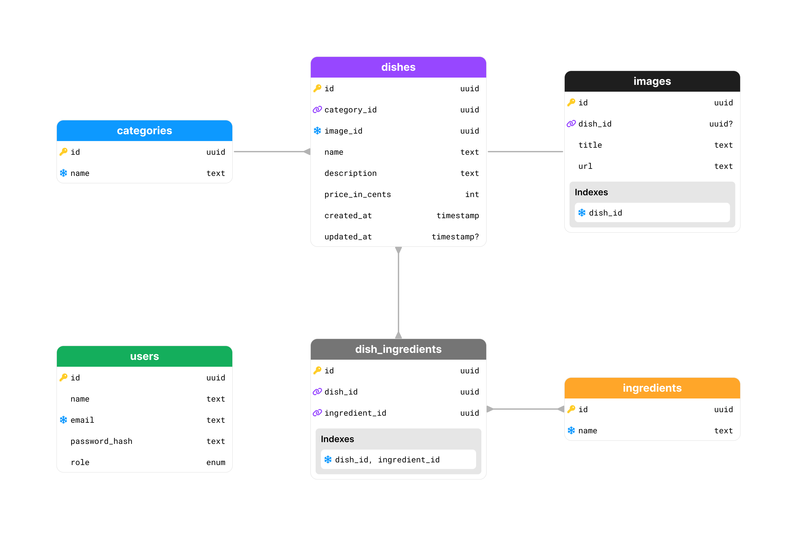

<h1 align="center">
  
</h1>

<p align="center">Explorer | Final Challenge - Food Explorer Backend</p>

<p align="center">
  <a href="#-projeto">Projeto</a>&nbsp;&nbsp;&nbsp;|&nbsp;&nbsp;&nbsp;
  <a href="#-tecnologias">Tecnologias</a>&nbsp;&nbsp;&nbsp;|&nbsp;&nbsp;&nbsp;
  <a href="#%EF%B8%8F-pré-requisitos">Pré requisitos</a>&nbsp;&nbsp;&nbsp;|&nbsp;&nbsp;&nbsp;
  <a href="#-como-executar">Como Executar</a>&nbsp;&nbsp;&nbsp;|&nbsp;&nbsp;&nbsp;
  <a href="#-licença">Licença</a>&nbsp;&nbsp;&nbsp;|&nbsp;&nbsp;&nbsp;
  <a href="#-autor">Autor</a>
</p>

<p align="center">
  <a href="https://github.com/jordane-chaves/food-explorer-backend/blob/main/LICENSE">
    
  </a>
</p>

## 💻 Projeto

**Food Explorer** é um cardápio digital interativo, construído para um restaurante fictício.

Esta aplicação possui duas personas, o "admin" que pode gerenciar todos os pratos e o "cliente" que pode listar os pratos cadastrados e visualizar detalhes de algum prato.

Aproveitei a oportunidade para aplicar alguns conceitos de Clean Architecture, Domain-Driven Design (DDD) e alguns outros patterns como Repository e Factory patterns.

Veja abaixo o diagrama do banco de dados:

<p align="center">
  
</p>

> [!NOTE]
> Link de deploy: https://food-explorer-backend-5xzl.onrender.com

## 🚀 Tecnologias

Esse projeto foi desenvolvido com as seguintes tecnologias:

- [Node.js](https://nodejs.org/en)
- [TypeScript](https://www.typescriptlang.org/)
- [Express](https://expressjs.com)
- [Knex](https://knexjs.org/)
- [Postgres](https://www.postgresql.org/)
- [Docker](https://www.docker.com/)
- [JWT](https://jwt.io/)
- [Vitest](https://vitest.dev/)
- [Swagger](https://swagger.io/)
- [Scalar](https://scalar.com/swagger-editor)

## 🛠️ Pré requisitos

**Variáveis de ambiente**

> [!IMPORTANT]
> Crie uma cópia do arquivo `.env.example` para `.env` e preencha todas as variáveis de ambiente.

**Banco de dados (Docker)**

Algumas queries do projeto precisam ser executadas em um banco PostgreSQL.
Deixei um arquivo do docker configurado para executar o banco localmente se necessário.

```bash
# Execute o banco de dados com docker
docker compose up -d
```

**Cliente HTTP (Opcional)**

Caso queira testar a API sem o front-end instale a extensão [REST Client](https://marketplace.visualstudio.com/items?itemName=humao.rest-client) no [VS Code](https://code.visualstudio.com/). Acesse o arquivo [cliente.http](https://github.com/jordane-chaves/food-explorer-backend/blob/main/client.http) para testar e verificar todas as rotas disponíveis.

## 🎲 Como executar

```bash
# Clone este repositório
$ git clone https://github.com/jordane-chaves/food-explorer-backend

# Acesse o diretório do projeto no terminal/cmd
$ cd food-explorer-backend

# Instale as dependências
$ npm install

# Crie as tabelas no banco de dados
$ npm run knex:migrate

# Execute a aplicação em modo de desenvolvimento
$ npm run start:dev

# O servidor inciará na porta:3333 - acesse <http://localhost:3333>
# Documentação da API - acesse <http://localhost:3333/docs>
```

## 📝 Licença

Esse projeto está sob a licença MIT - veja o arquivo [LICENSE](https://github.com/jordane-chaves/food-explorer-backend/blob/main/LICENSE) para mais detalhes.

## 👨🏻‍💻 Autor


Feito com 💜 por Jordane Chaves
